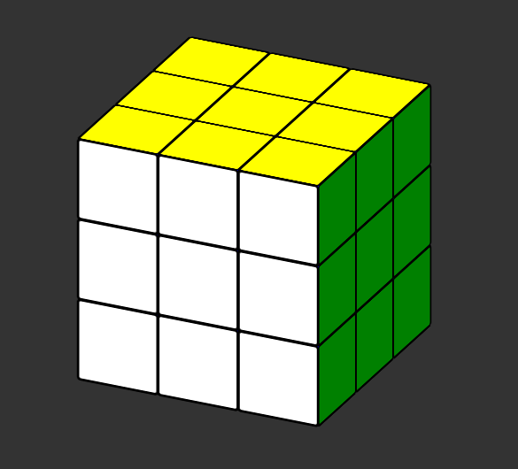

3D Rubik's Cube in CSS3 and HTML
==================

Rubik's Cube made in CSS3 and HTML.

*Javascript added only for rotate and enable/disable css3 animation on cube*

##[Demo](<http://codepen.io/lukasz-zak/full/tfDHq>)##
